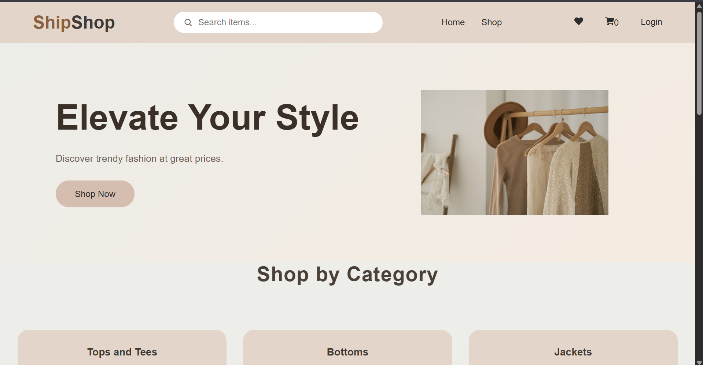

# 🛍️ ShipShop

ShipShop is a modern e-commerce web application built with React. It provides a clean shopping experience with product browsing, search functionality, wishlist management, and a shopping cart.

## 🚀 Live Demo

🔗Live Demo: https://ship-shop-yoj9.vercel.app

---

## 📸 Screenshot

---

## ✨ Features

- 🛒 Browse products
- ❤️ Add and remove products from Wishlist
- 🛍️ Add and remove products from Cart
- 🔍 Search products by name
- 📄 Product Details page
- 📱 Responsive design
- ⚡ Fast navigation using React Router
- 🎨 Clean and modern UI

---

## 🛠️ Built With

- React
- JavaScript (ES6+)
- React Router
- Context API
- HTML5
- CSS3
## 💡 Future Improvements

- User Authentication
- Product Filters
- Checkout Page
- Payment Gateway Integration
- Order History
- Backend Integration
- Product Reviews

---

## 👩‍💻 Author

**Shwetha C**

- GitHub: https://github.com/shwetha-c-hub
- LinkedIn: http://linkedin.com/in/shwetha-c-2a2ba1357

---